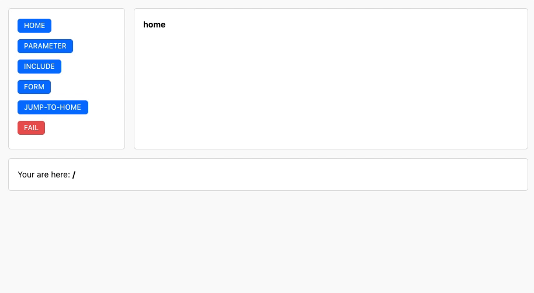

# zeit-integration-router

[](https://github.com/zeit/awesome-zeit-integrations)

<p align="center">
  
</p>

## What is this?

This is a small router concept for zeit integrations. It support the basic functionality of a router and some extras like parameters.

**DEMO**: [https://zeit.co/integrations/integration-router](https://zeit.co/integrations/integration-router)
**Example**: go to `src/example`

## How to?

The only file you need is `src/libs/router.ts`. Import it at the top of your entrypoint.

```bash
npm i zeit-router
# or
yarn add zeit-router
```

```javascript
import { ZeitRouter } from 'zeit-router';

// with optinal start route (default: '/')
const app = new ZeitRouter('/');
```

**Note**: The current route is saved to `currentPath` inside `metadata`, so do not overwrite it.

`libs/router.ts` returns a class. The class has 2 Methods.

### add(path, cb, silent)

This method adds a route. You can define the path like you do in `express` or other frameworks.
The callback function gives you `handler(zeitClient, payload)`, `router` and `params`. You have to return a `htm` method.
`silent`(default: false): If this parameter is set to `true`, this page will not be rendered again after a reload and the previous page will be displayed instead.
This is a useful flag for confirmation fields.

```javascript
app.add('/:id', ({ handler, router, params }) => {
  return htm`<Box>
    <B>${params.id}</B>
  </Box>`;
});
```

### uiHook(handler, router)

This methods wraps `withUiHook` and adds an additional `router`-object to the callback function.

```javascript
export default app.uiHook(async (handler: HandlerOptions, router: Router) => {
  return htm`<Page>${router.currentPath}</Page>`;
});
```

---

## `router`-object

#### async navigate(path)

- Navigate through a specific route. Works only inside the `app.uiHook`.

#### currentRoute

- Shows the current route. Returns a promise.

#### previousRoute

- Shows the previous route. Returns a promise.

#### renderRoute(path)

- Renders a specific route.


## Routing

All `actions` which start with a `/`, will automatically navigate trough a matching route.
You can also navigate with the `router.navigate` method.


## Full Example:

```javascript
import { ZeitRouter } from 'zeit-router';
import { HandlerOptions, Router } from '../types';

const app = new ZeitRouter('/');

app.add('/', () => {
  return htm`<Box>
    <B>home</B>
  </Box>`;
});

app.add('/parameter/:id', ({ params }) => {
  return htm`<Box>
    <B>${params.id}</B>
  </Box>`;
});

const uiHook = app.uiHook(async (handler: HandlerOptions, router: Router) => {
  const {
    payload: { action }
  } = handler;

  if (action === 'home') {
    await router.navigate('/');
  }

  return htm`<Page>
    <Button action="home" small highlight>home</Button>
    <Button action="/parameter/123" small highlight>parameter</Button>
    <Button action="fail" small warning>fail</Button>

    ${await router.currentRoute}

    Your are here: <B>${router.currentPath}</B>
  </Page>`;
});
```

## Development

1. clone this repository
2. install the [now cli](https://github.com/zeit/now-cli)
3. run following commands:

```bash
yarn install && yarn now:dev
```

or

```bash
npm install && npm run now:dev
```

4. The server starts on port **5005**

[More information](https://zeit.co/docs/integrations/#creating-an-integration/step-2-creating-a-uihook/running-the-uihook-locally)

You can also use `yarn dev` or `npm run dev`. This command will start a dev server which supports autoreloading on file change. (You need to install `nodemon`)


## Used by:

* Secrets (https://zeit.co/integrations/secrets)[https://zeit.co/integrations/secrets]
